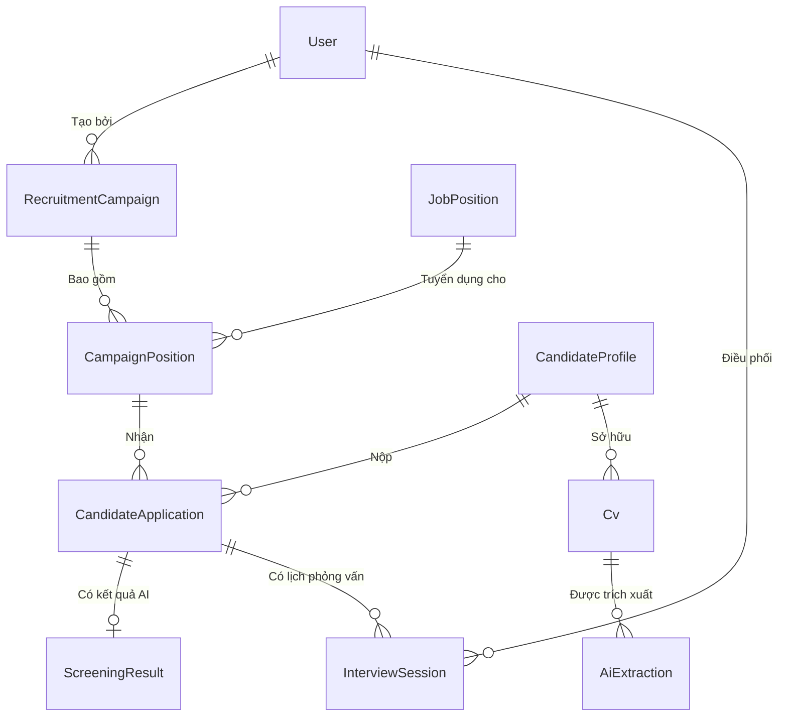

# Cơ Sở Dữ Liệu HR Bot (Database Documentation)

Hệ thống **HR Bot** sử dụng **PostgreSQL** kết hợp Prisma ORM. Điểm đặc biệt của cơ sở dữ liệu này là việc sử dụng extension **`pgvector`** để thực hiện phân tích và tìm kiếm ngữ nghĩa (Semantic Search) cho hệ thống AI.

Dưới đây là sơ đồ kiến trúc và giải thích các bảng cốt lõi trong hệ thống.

---

## 1. Sơ Đồ Thực Thể (ERD - Lõi Tuyển Dụng)

---

## 2. Các Bảng (Tables) Chính

### Hệ Thống & Phân Quyền (Auth & Admin)
*   **`users`**: Quản lý thông tin nhà tuyển dụng/quản trị viên. Có trường `role` (`ADMIN`, `RECRUITER`).
*   **`refresh_tokens` / `password_reset_tokens`**: Phục vụ bảo mật xác thực (JWT) và cấp lại mật khẩu.
*   **`activity_logs`**: Lưu nhật ký hệ thống dùng để audit (theo dõi hành động của User).

### Chiến Dịch Tuyển Dụng (Campaigns & Positions)
*   **`recruitment_campaigns`**: Các chiến dịch tuyển dụng (ví dụ: "Tuyển dụng kỹ sư IT Quý 3").
*   **`job_positions`**: Ngân hàng các vị trí công việc sẵn có (Backend Dev, Marketing...).
*   **`campaign_positions`**: Bảng trung gian gán các `job_positions` vào một `recruitment_campaigns` với số lượng chỉ tiêu và deal lương cụ thể.
*   **`job_descriptions`**: Chứa yêu cầu công việc, phúc lợi, mô tả chi tiết của `job_positions`.
*   **`skills` & `position_skills`**: Cây kỹ năng và bảng gán kỹ năng vào `job_positions` kèm mức độ yêu cầu (dùng để so khớp AI).

### Ứng Viên & Hệ Thống Đánh Giá (Candidates & Screening)
*   **`candidate_profiles`**: Lưu thông tin cốt lõi của ứng viên (Tên, liên hệ, đại học, số năm kinh nghiệm).
*   **`candidate_embeddings`**: *(Cực kỳ quan trọng)* Sử dụng field `embedding` kiểu `Unsupported("vector")` để lưu vector đại diện cho CV ứng viên, phục vụ tính năng tìm kiếm ngữ nghĩa siêu nhanh bằng pgvector.
*   **`cvs`**: Thông tin file CV (lưu trữ trên MinIO/S3).
*   **`ai_extractions`**: Dữ liệu JSON thô và văn bản tóm tắt mà AI (Google Gemini / OpenAI) trích xuất được từ file CV PDF.
*   **`candidate_applications`**: Đơn ứng tuyển của `candidate` vào một `campaign_position`. Chứa trạng thái (APPLIED, VIRTUAL_INTERVIEW, HR_REVIEW...).
*   **`screening_results`**: Kết quả AI chấm điểm độ phù hợp của CV với `job_descriptions`. Có lưu điểm tổng thể, điểm kỹ năng, học vấn và "danh sách kỹ năng còn thiếu".

### Phỏng Vấn AI (Virtual Interviews)
*   **`interview_sessions`**: Phiên phỏng vấn của một đơn ứng tuyển. Lưu `meeting_url`, trạng thái (PENDING, COMPLETED, CANCELLED), và lưu **`transcript`** (đoạn chat hội thoại AI) cùng **`ai_evaluation`** (Nhận xét của AI về ứng viên sau khi kết thúc).
*   **`interview_questions` / `interview_answers`**: Quản lý bộ câu hỏi linh hoạt và kết quả trả lời từng câu.

### Xử Lý Bất Đồng Bộ (Background Jobs)
*   **`file_processing_jobs`**: Bảng theo dõi trạng thái các tác vụ nặng được gửi vào BullMQ (ví dụ: bóc tách CV, tạo Embedding, đánh giá Phỏng vấn).

---

## 3. Chú Ý Kỹ Thuật
1. Tất cả khóa chính đều dùng **UUID** để bảo mật và mở rộng phân tán.
2. Việc sử dụng **JSON/JSONB** (`parsedJson` trong bảng `ai_extractions`, `transcript` trong `interview_sessions`) cho phép AI tự do cập nhật cấu trúc schema phản hồi mà không cần migrate liên tục.
3. Nếu bạn xóa (Delete) một Chiến dịch, tất cả dữ liệu phụ thuộc (Member, Applications) sẽ tự động bị xóa (dựa vào cơ chế `onDelete: Cascade` trong Prisma). Lịch sử ứng viên ở `candidate_profiles` vẫn sẽ được giữ lại trong hệ thống Talent Pool độc lập.
