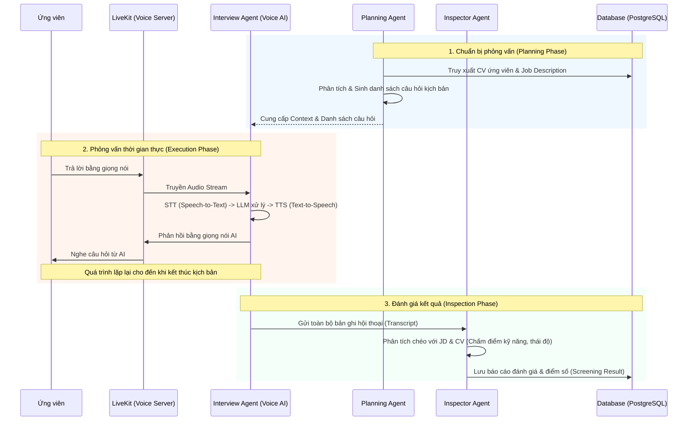

# 🚀 Công Nghệ và Kỹ Thuật Nâng Cao (Advanced Technologies)

Tài liệu này tổng hợp toàn bộ các công nghệ, kỹ thuật phức tạp và các luồng xử lý (Workflows) tiên tiến được sử dụng trong dự án HR-Bot nhằm giải quyết bài toán tuyển dụng tự động hóa với quy mô lớn.

---

## 1. Hệ Thống Real-time Voice AI & LiveKit (WebRTC)
Dự án không sử dụng các phương thức gọi API Text-to-Speech thông thường (vốn có độ trễ cao) mà xây dựng hẳn một hệ thống **Voice AI thời gian thực** (Real-time).
- **LiveKit (WebRTC):** Được sử dụng làm cơ sở hạ tầng truyền phát âm thanh/video với độ trễ siêu thấp (sub-second latency) giữa ứng viên trên trình duyệt và AI Server.
- **Luồng xử lý (Pipeline):** 
  - Ứng viên nói vào Micro -> LiveKit truyền Audio đến Python Worker.
  - Python Worker chạy **Groq Whisper (STT)** để chuyển âm thanh thành chữ tức thì (nhờ chip LPU).
  - Trí tuệ nhân tạo **Google Gemini 2.0 Flash (LLM)** nhận chữ, phân tích CV/Kịch bản phỏng vấn, và sinh ra câu trả lời.
  - **Microsoft Edge TTS** ngay lập tức chuyển câu trả lời thành luồng âm thanh dạng sóng (Audio stream) đẩy lại vào phòng LiveKit.

## 2. Kiến Trúc Agent & Luồng Hoạt Động Của AI
Hệ thống sử dụng các Agent (Tác tử AI) độc lập, chạy trên môi trường Python FastAPI:
- **Interview Agent:** Đóng vai trò làm nhà tuyển dụng, có khả năng lắng nghe, phân tích phản hồi của ứng viên dựa trên CV (Context) và đưa ra câu hỏi bám sát chuyên môn.
- **Inspector / Planning Agent (Mô hình Multi-Agent):** Agent có khả năng lên kế hoạch (Planning) các câu hỏi và đánh giá (Inspect) toàn bộ buổi phỏng vấn sau khi kết thúc để xuất ra báo cáo năng lực.

## 3. Hệ Thống Semantic Search & Vector Embeddings
Thay vì tìm kiếm CV bằng từ khóa (Keyword-based) lỗi thời, dự án sử dụng **Tìm Kiếm Ngữ Nghĩa (Semantic Search)**.
- **Mô hình Embedding:** Chuyển đổi toàn bộ kỹ năng, kinh nghiệm của ứng viên thành các Vector đa chiều.
- **pgvector (PostgreSQL):** Lưu trữ các Vector này trực tiếp trong CSDL Relational.
- **Chấm điểm CV:** Khi có một Job Description (JD) mới, hệ thống cũng chuyển JD thành Vector, tính toán khoảng cách (Cosine Similarity) để đưa ra **điểm độ phù hợp (Match Score)**.

## 4. Xử Lý Bất Đồng Bộ (Asynchronous) & Message Queue (BullMQ)
Trong tuyển dụng, các tác vụ như phân tích hàng trăm CV bằng AI hay gửi hàng loạt Email không thể chạy đồng bộ vì sẽ làm nghẽn Server.
- **BullMQ + Redis:** Sử dụng để đẩy các tác vụ nặng vào Hàng đợi (Queue).
- Các Background Workers (Worker ẩn) sẽ bốc tuần tự các Job này ra xử lý, giúp Backend Node.js (NestJS) luôn đạt phản hồi cực nhanh (non-blocking).

## 5. WebSockets & Real-time Notifications
- **Socket.IO:** Được tích hợp vào NestJS để đẩy các thông báo (Notifications) theo thời gian thực tới Frontend. 
- Khi một CV được phân tích xong bởi BullMQ, Worker sẽ bắn sự kiện qua WebSocket giúp Frontend tự động hiển thị kết quả mà người dùng không cần phải F5 tải lại trang.

## 6. CV Parser (Trích Xuất Thông Tin Thông Minh)
- Không dùng Regex (Biểu thức chính quy) truyền thống, dự án sử dụng **LLM (Gemini/OpenAI)** kết hợp với kỹ thuật **Structured Data Extraction**.
- AI đọc toàn bộ file PDF hỗn loạn và trả về một cấu trúc JSON chuẩn (bao gồm: Thông tin cá nhân, Học vấn, Kinh nghiệm làm việc, Kỹ năng) với độ chính xác tuyệt đối.

## 7. Đa Nền Tảng API: GraphQL & RESTful
- Hệ thống hỗ trợ song song hai chuẩn API:
  - **RESTful API:** Dùng cho các tác vụ truyền tải file (Upload CV), Webhooks (nhận trigger từ Python Worker) và các nghiệp vụ cơ bản.
  - **GraphQL (Apollo):** Giúp Frontend linh hoạt lấy đúng lượng dữ liệu mong muốn (tránh Over-fetching / Under-fetching), đặc biệt hiệu quả ở các màn hình Dashboard chứa nhiều bảng dữ liệu phức tạp.

## 8. Kỹ Thuật Nâng Cấp Giao Diện (UI/UX Enhancements)
Giao diện không dừng lại ở mức cơ bản, mà được áp dụng các triết lý thiết kế hiện đại nhất:
- **Glassmorphism / Mica / Acrylic Blur:** Áp dụng hiệu ứng nền kính mờ xuyên thấu (nhờ Backdrop Filter của CSS) tương tự như thiết kế của Windows 11 và iOS, kết hợp với Mesh Gradients tạo chiều sâu cho giao diện.
- **Lottie Animations / WebGL:** Sử dụng ảnh động vector JSON (Lottie) cho các màn hình Loading, Analyzing AI, giúp trải nghiệm tương tác (Micro-interactions) của người dùng mượt mà và sinh động hơn ảnh tĩnh hoặc GIF truyền thống.
- **Zustand:** Quản lý State nhẹ nhàng, linh hoạt thay thế cho Redux cồng kềnh.

## 9. Các Công Cụ Tiện Ích Và Cơ Sở Hạ Tầng (Infrastructure & Utilities)
Dự án được xây dựng với tư duy Scale-out (mở rộng ngang) như một hệ thống thực thụ, áp dụng các công cụ mạnh mẽ:
- **Prisma (Next-generation ORM):** Thay vì viết SQL thuần hoặc dùng các ORM cũ (như TypeORM/Sequelize), dự án sử dụng Prisma để đảm bảo Type-safe tuyệt đối từ Database lên tới tận Frontend, tự động sinh ra các Type của TypeScript và quản lý Migration dễ dàng.
- **MinIO (S3-Compatible Object Storage):** CV của ứng viên (file PDF) không lưu thẳng vào ổ cứng Server (cách làm truyền thống dễ gây quá tải và khó backup) mà được lưu vào hệ thống MinIO. Đây là một Object Storage mô phỏng hoàn toàn chuẩn API của Amazon S3, sẵn sàng đưa lên Cloud bất cứ lúc nào.
- **MailHog (Local SMTP Testing):** Hệ thống có tính năng gửi Email (ví dụ: thông báo trúng tuyển, gửi OTP). Để tránh spam mail thật trong lúc phát triển và test, dự án tích hợp MailHog để hứng toàn bộ các email được gửi đi, cung cấp giao diện Web (UI) để lập trình viên xem nội dung Email ngay lập tức.

## 10. Tích hợp CI/CD với GitHub Actions & Gitleaks
Hệ thống áp dụng các quy trình phát triển hiện đại (DevOps) để đảm bảo chất lượng và bảo mật mã nguồn:
- **GitHub Actions (CI Pipeline):** Tự động hóa quá trình kiểm thử và đóng gói. Mỗi khi có thay đổi mã nguồn (Push/Pull Request), GitHub Actions sẽ tự động cài đặt dependency, chạy Linter và Build ứng dụng (cả Frontend và Backend) trong môi trường tĩnh, đảm bảo code không bị lỗi trước khi Merge.
- **Gitleaks (Kiểm soát bảo mật):** Tích hợp công cụ Gitleaks vào quy trình CI. Công cụ này quét toàn bộ lịch sử commit để ngăn chặn việc rò rỉ (leak) các thông tin nhạy cảm như API Keys, Secret Tokens, hoặc mật khẩu Database bị vô tình đẩy lên kho lưu trữ mã nguồn.
