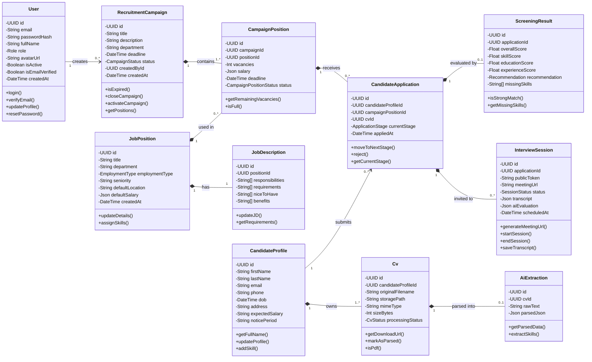

# Sơ Đồ Lớp (Class Diagram) & Đặc Tả Chi Tiết - HR Bot

Tài liệu này cung cấp Sơ đồ Lớp (Class Diagram) và bảng đặc tả chi tiết các lớp (Class) quan trọng nhất trong hệ thống HR Bot, dựa trên thiết kế thực tế của cơ sở dữ liệu Prisma và logic backend.

---

## 1. Sơ Đồ Lớp (Class Diagram)

Sơ đồ sử dụng chuẩn UML để mô tả các thuộc tính, phương thức cơ bản và mối quan hệ giữa các đối tượng.

---

## 2. Đặc Tả Chi Tiết Các Lớp Cốt Lõi

### 2.1. Lớp `User`
Lớp đại diện cho người dùng hệ thống (Nhà tuyển dụng, Quản trị viên).
*   **Thuộc tính:**
    *   `id` (UUID): Định danh duy nhất.
    *   `email` (String): Địa chỉ email đăng nhập (Unique).
    *   `passwordHash` (String): Mật khẩu đã được mã hóa bcrypt.
    *   `fullName` (String): Tên đầy đủ.
    *   `role` (Enum): Vai trò (`ADMIN`, `RECRUITER`).
    *   `avatarUrl` (String): Đường dẫn ảnh đại diện.
    *   `isActive` (Boolean): Trạng thái hoạt động của tài khoản.
    *   `isEmailVerified` (Boolean): Trạng thái xác thực email.
*   **Phương thức:**
    *   `login()`: Kiểm tra mật khẩu và tạo JWT Token.
    *   `verifyEmail()`: Cập nhật `isEmailVerified` thành `true`.
    *   `resetPassword()`: Cập nhật mật khẩu mới.

### 2.2. Lớp `RecruitmentCampaign`
Lớp quản lý các chiến dịch tuyển dụng theo từng đợt của công ty.
*   **Thuộc tính:**
    *   `id` (UUID): Định danh chiến dịch.
    *   `title` (String): Tên chiến dịch (VD: Tuyển dụng Fresher 2024).
    *   `department` (String): Phòng ban phụ trách.
    *   `deadline` (DateTime): Thời hạn đóng chiến dịch.
    *   `status` (Enum): `DRAFT`, `ACTIVE`, `CLOSED`.
    *   `createdById` (UUID): ID của người tạo (FK tới `User`).
*   **Phương thức:**
    *   `isExpired()`: Kiểm tra xem thời gian hiện tại đã vượt qua `deadline` chưa.
    *   `closeCampaign()`: Cập nhật `status` thành `CLOSED`.
    *   `activateCampaign()`: Đưa chiến dịch vào trạng thái `ACTIVE` để nhận ứng viên.

### 2.3. Lớp `JobPosition` & `JobDescription`
Lớp lưu trữ ngân hàng các vị trí công việc có sẵn và mô tả chi tiết của chúng.
*   **Thuộc tính (JobPosition):**
    *   `title` (String): Tên vị trí (VD: Backend Developer).
    *   `employmentType` (Enum): `FULL_TIME`, `PART_TIME`, `INTERNSHIP`...
    *   `seniority` (String): Cấp bậc (Intern, Junior, Senior...).
*   **Thuộc tính (JobDescription):**
    *   `responsibilities` (String[]): Trách nhiệm công việc.
    *   `requirements` (String[]): Yêu cầu bắt buộc (kỹ năng, kinh nghiệm).
    *   `niceToHave` (String[]): Yêu cầu điểm cộng.
    *   `benefits` (String[]): Quyền lợi.
*   **Phương thức:**
    *   `updateJD()`: Cập nhật lại các mảng yêu cầu công việc.
    *   `assignSkills()`: Gắn các kỹ năng chuẩn mực (`Skill`) vào vị trí.

### 2.4. Lớp `CampaignPosition`
Lớp trung gian thể hiện việc một Vị trí (`JobPosition`) được đem ra tuyển dụng trong một Chiến dịch (`RecruitmentCampaign`) với các điều kiện cụ thể.
*   **Thuộc tính:**
    *   `vacancies` (Int): Số lượng chỉ tiêu tuyển dụng.
    *   `salary` (Json): Mức lương offer cho đợt này (min, max, currency).
    *   `deadline` (DateTime): Hạn chót nộp đơn cho vị trí này.
    *   `status` (Enum): Trạng thái mở/đóng.
*   **Phương thức:**
    *   `getRemainingVacancies()`: Trả về số lượng chỉ tiêu còn lại.
    *   `isFull()`: Kiểm tra nếu số người được nhận (Offer) đã đủ `vacancies`.

### 2.5. Lớp `CandidateProfile` & `Cv`
Quản lý thông tin hồ sơ gốc của ứng viên.
*   **Thuộc tính (CandidateProfile):**
    *   `firstName`, `lastName` (String): Họ và Tên.
    *   `email` (String), `phone` (String): Thông tin liên lạc.
    *   `expectedSalary` (String): Mức lương mong muốn.
    *   `noticePeriod` (String): Thời gian có thể bắt đầu làm việc.
*   **Thuộc tính (Cv):**
    *   `originalFilename` (String): Tên file gốc lúc ứng viên tải lên.
    *   `storagePath` (String): Đường dẫn lưu trên MinIO/S3.
    *   `processingStatus` (Enum): Quá trình AI xử lý (`PENDING`, `PARSING`, `SCREENING`, `DONE`, `FAILED`).
*   **Phương thức:**
    *   `getFullName()`: Trả về Tên đầy đủ ghép từ first/last name.
    *   `getDownloadUrl()`: Lấy pre-signed URL từ MinIO để xem CV.
    *   `markAsParsed()`: Đánh dấu CV đã được AI đọc thành công.

### 2.6. Lớp `CandidateApplication`
Lớp lưu trữ quá trình ứng tuyển của một ứng viên vào một vị trí cụ thể.
*   **Thuộc tính:**
    *   `candidateProfileId` (UUID): ID ứng viên nộp đơn.
    *   `campaignPositionId` (UUID): ID vị trí đang tuyển.
    *   `cvId` (UUID): ID của bản CV dùng để nộp.
    *   `currentStage` (Enum): `APPLIED`, `HR_REVIEW`, `VIRTUAL_INTERVIEW`, `INTERVIEW`, `OFFER`, `REJECTED`.
    *   `appliedAt` (DateTime): Ngày giờ nộp.
*   **Phương thức:**
    *   `moveToNextStage()`: Đẩy ứng viên sang vòng tiếp theo trong pipeline.
    *   `reject()`: Chuyển thẳng `currentStage` thành `REJECTED`.

### 2.7. Lớp `AiExtraction` & `ScreeningResult`
Kết quả làm việc của AI (Trích xuất văn bản và Chấm điểm).
*   **Thuộc tính (AiExtraction):**
    *   `parsedJson` (Json): Lưu cấu trúc JSON bóc tách được (Học vấn, Kinh nghiệm, Kỹ năng) từ PDF.
*   **Thuộc tính (ScreeningResult):**
    *   `overallScore` (Float): Điểm tổng quan AI đánh giá (0-100).
    *   `recommendation` (Enum): Đề xuất của AI (`STRONG_RECOMMEND`, `RECOMMEND`, `CONSIDER`, `REJECT`).
    *   `missingSkills` (String[]): Danh sách kỹ năng yêu cầu mà ứng viên còn thiếu.
*   **Phương thức:**
    *   `isStrongMatch()`: Trả về true nếu `overallScore` >= 80 và `recommendation` là `STRONG_RECOMMEND`.

### 2.8. Lớp `InterviewSession`
Lớp quản lý các cuộc phỏng vấn tự động với AI Voice Agent (LiveKit).
*   **Thuộc tính:**
    *   `publicToken` (String): Token không cần đăng nhập để ứng viên tham gia phòng.
    *   `meetingUrl` (String): URL của phòng LiveKit.
    *   `status` (Enum): `SCHEDULED`, `ONGOING`, `COMPLETED`, `CANCELLED`.
    *   `transcript` (Json): Toàn bộ lịch sử cuộc trò chuyện (Speaker, Text, Timestamp).
    *   `aiEvaluation` (Json): Bài chấm điểm và nhận xét về thái độ, chuyên môn của ứng viên sau khi gọi xong.
*   **Phương thức:**
    *   `generateMeetingUrl()`: Tạo URL phòng LiveKit.
    *   `startSession()`: Chuyển trạng thái thành `ONGOING`.
    *   `saveTranscript(transcriptData)`: Lưu hội thoại để phục vụ xem lại.
