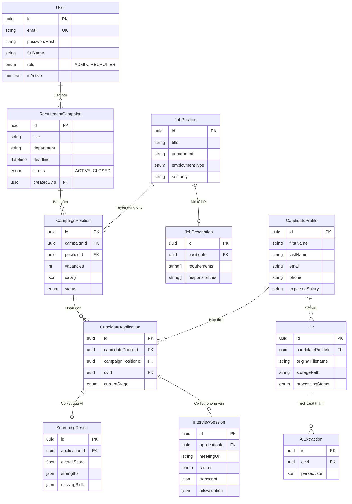

# Cơ Sở Dữ Liệu HR Bot (Database Documentation)

Hệ thống **HR Bot** sử dụng **PostgreSQL** kết hợp Prisma ORM. Điểm đặc biệt của cơ sở dữ liệu này là việc sử dụng extension **`pgvector`** để thực hiện phân tích và tìm kiếm ngữ nghĩa (Semantic Search) cho hệ thống AI.

Dưới đây là sơ đồ kiến trúc và giải thích các bảng cốt lõi trong hệ thống.

---

## 1. Sơ Đồ Thực Thể (ERD - Lõi Tuyển Dụng)

Sơ đồ ERD dưới đây mô tả cấu trúc các bảng chính cùng với các thuộc tính cốt lõi và mối quan hệ giữa chúng.

---

## 2. Các Bảng (Tables) Chính & Thuộc Tính Nổi Bật

### Hệ Thống & Phân Quyền (Auth & Admin)
*   **`User`**: Quản lý thông tin nhà tuyển dụng/quản trị viên. 
    *   Thuộc tính chính: `id`, `email`, `passwordHash`, `fullName`, `role` (`ADMIN`, `RECRUITER`), `avatarUrl`, `isActive`, `isEmailVerified`.
*   **`RefreshToken` / `PasswordResetToken` / `EmailVerificationToken`**: Phục vụ bảo mật xác thực và phiên đăng nhập.
    *   Thuộc tính chính: `id`, `userId`, `tokenHash`, `expiresAt`, `usedAt`, `revokedAt`.
*   **`ActivityLog`**: Lưu nhật ký hệ thống dùng để audit (theo dõi hành động của User).
    *   Thuộc tính chính: `id`, `userId`, `action`, `entityType`, `entityId`, `details` (JSON).

### Chiến Dịch Tuyển Dụng (Campaigns & Positions)
*   **`RecruitmentCampaign`**: Các chiến dịch tuyển dụng.
    *   Thuộc tính chính: `id`, `title`, `description`, `department`, `deadline`, `status` (`DRAFT`, `ACTIVE`, `CLOSED`), `createdById`.
*   **`JobPosition`**: Ngân hàng các vị trí công việc sẵn có.
    *   Thuộc tính chính: `id`, `title`, `department`, `employmentType` (FULL_TIME, PART_TIME, etc.), `seniority`, `defaultLocation`, `defaultSalary` (JSON).
*   **`CampaignPosition`**: Bảng trung gian gán các `JobPosition` vào một `RecruitmentCampaign`.
    *   Thuộc tính chính: `id`, `campaignId`, `positionId`, `vacancies`, `salary` (JSON), `deadline`, `status`.
*   **`JobDescription`**: Chứa yêu cầu công việc.
    *   Thuộc tính chính: `id`, `positionId`, `responsibilities` (Array), `requirements` (Array), `niceToHave` (Array), `benefits` (Array).
*   **`Skill` & `PositionSkill`**: Quản lý kỹ năng và gán kỹ năng vào `JobPosition`.
    *   Thuộc tính chính của `PositionSkill`: `positionId`, `skillId`, `requiredLevel` (1-5), `isRequired`.

### Ứng Viên & Hệ Thống Đánh Giá (Candidates & Screening)
*   **`CandidateProfile`**: Lưu thông tin cốt lõi của ứng viên.
    *   Thuộc tính chính: `id`, `firstName`, `lastName`, `email`, `phone`, `dob`, `address`, `expectedSalary`, `noticePeriod`.
*   **`CandidateEmbedding`**: *(Cực kỳ quan trọng)*. Phục vụ tính năng tìm kiếm ngữ nghĩa siêu nhanh bằng pgvector.
    *   Thuộc tính chính: `id`, `candidateProfileId`, `embedding` (kiểu dữ liệu: `Unsupported("vector")`), `sourceType`, `sourceId`.
*   **`Cv`**: Thông tin file CV (lưu trữ trên MinIO/S3).
    *   Thuộc tính chính: `id`, `candidateProfileId`, `originalFilename`, `storagePath`, `sizeBytes`, `processingStatus` (`PENDING`, `PARSING`, `SCREENING`, `DONE`, `FAILED`), `uploadedById`.
*   **`AiExtraction`**: Dữ liệu AI trích xuất được từ file CV PDF.
    *   Thuộc tính chính: `id`, `cvId`, `modelName`, `rawText`, `parsedJson` (JSONB chứa kinh nghiệm, học vấn, chứng chỉ).
*   **`CandidateApplication`**: Đơn ứng tuyển của `CandidateProfile` vào một `CampaignPosition`.
    *   Thuộc tính chính: `id`, `candidateProfileId`, `campaignPositionId`, `cvId`, `currentStage` (`APPLIED`, `HR_REVIEW`, `VIRTUAL_INTERVIEW`, `OFFER`, `REJECTED`).
*   **`ScreeningResult`**: Kết quả AI chấm điểm độ phù hợp của CV với `JobDescription`.
    *   Thuộc tính chính: `id`, `applicationId`, `overallScore`, `skillScore`, `educationScore`, `experienceScore`, `recommendation`, `strengths` (Array), `weaknesses` (Array), `missingSkills` (Array), `explanation`.

### Phỏng Vấn AI (Virtual Interviews)
*   **`InterviewSession`**: Phiên phỏng vấn của một đơn ứng tuyển.
    *   Thuộc tính chính: `id`, `applicationId`, `publicToken`, `meetingUrl`, `status` (`SCHEDULED`, `ONGOING`, `COMPLETED`), `transcript` (JSON lưu toàn bộ hội thoại), `aiEvaluation` (JSON lưu nhận xét và điểm số của Voice Agent).
*   **`InterviewQuestion` / `InterviewAnswer`**: Quản lý bộ câu hỏi linh hoạt.
    *   Thuộc tính chính: `id`, `sessionId`, `questionText`, `expectedAnswer`, `actualAnswer`, `score`, `aiFeedback`.

### Xử Lý Bất Đồng Bộ (Background Jobs)
*   **`FileProcessingJob`**: Bảng theo dõi trạng thái các tác vụ nặng được gửi vào BullMQ (ví dụ: bóc tách CV, tạo Embedding, đánh giá Phỏng vấn).
    *   Thuộc tính chính: `id`, `cvId`, `jobId`, `status`, `result`, `error`.

---

## 3. Chú Ý Kỹ Thuật
1. Tất cả khóa chính đều dùng **UUID** để bảo mật và mở rộng phân tán.
2. Việc sử dụng **JSON/JSONB** (`parsedJson` trong bảng `ai_extractions`, `transcript` trong `interview_sessions`) cho phép AI tự do cập nhật cấu trúc schema phản hồi mà không cần migrate liên tục.
3. Nếu bạn xóa (Delete) một Chiến dịch, tất cả dữ liệu phụ thuộc (Member, Applications) sẽ tự động bị xóa (dựa vào cơ chế `onDelete: Cascade` trong Prisma). Lịch sử ứng viên ở `candidate_profiles` vẫn sẽ được giữ lại trong hệ thống Talent Pool độc lập.
