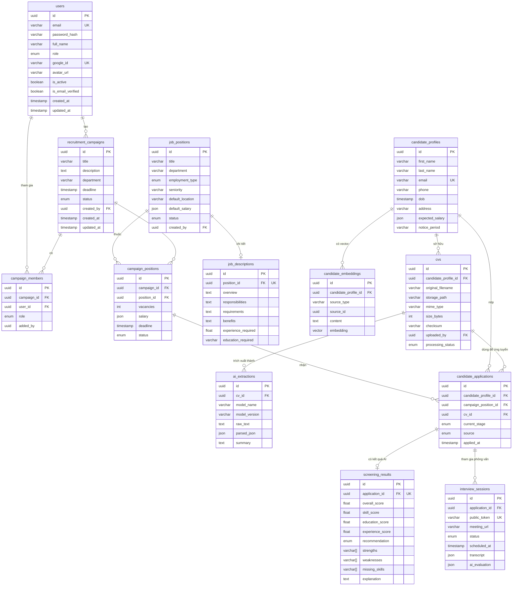

# Sơ Đồ Dữ Liệu Vật Lý (Physical Data Model / Relational Schema)

Tài liệu này thể hiện chính xác cấu trúc dữ liệu vật lý theo từng bảng (Table), các kiểu dữ liệu, các trường, và khóa ngoại (Foreign Key) đúng như mã nguồn thực tế đang triển khai dưới database PostgreSQL (được định nghĩa trong mã nguồn `schema.prisma`).

*Khác với Sơ đồ Thực thể Lớp (Class Diagram) hay ERD Khái niệm, sơ đồ này lấy trọng tâm là các bảng vật lý dưới Database (tên dùng snake_case).*

---

## 1. Sơ Đồ Dữ Liệu (Relational Schema Diagram)

---

## 2. Đặc Tả Chi Tiết Dữ Liệu (Physical Tables Specification)

### 2.1. Bảng `users`
| Tên Cột | Kiểu dữ liệu | Khóa | Ràng buộc | Ý nghĩa |
| :--- | :--- | :---: | :--- | :--- |
| `id` | UUID | PK | Mặc định: `uuid()` | Khóa chính |
| `email` | VARCHAR | UK | Unique, Not Null | Email đăng nhập |
| `password_hash` | VARCHAR | | Có thể Null | Mật khẩu hash |
| `full_name` | VARCHAR | | Not Null | Họ và tên |
| `role` | ENUM | | Mặc định: `RECRUITER` | `ADMIN`, `RECRUITER` |
| `google_id` | VARCHAR | UK | Unique, Có thể Null | Định danh Google OAuth |
| `avatar_url` | VARCHAR | | Có thể Null | Link ảnh đại diện |
| `is_active` | BOOLEAN | | Mặc định: `true` | Trạng thái hoạt động |
| `is_email_verified`| BOOLEAN | | Mặc định: `false` | Đã xác thực email chưa |
| `created_at` | TIMESTAMP | | Mặc định: `now()` | Ngày tạo |
| `updated_at` | TIMESTAMP | | Cập nhật tự động | Ngày cập nhật |

### 2.2. Bảng `recruitment_campaigns`
| Tên Cột | Kiểu dữ liệu | Khóa | Ràng buộc | Ý nghĩa |
| :--- | :--- | :---: | :--- | :--- |
| `id` | UUID | PK | Mặc định: `uuid()` | Khóa chính |
| `title` | VARCHAR | | Not Null | Tên chiến dịch |
| `description` | TEXT | | Có thể Null | Mô tả chiến dịch |
| `department` | VARCHAR | | Có thể Null | Phòng ban |
| `deadline` | TIMESTAMP | | Not Null | Hạn chót đóng chiến dịch |
| `status` | ENUM | | Mặc định: `DRAFT` | `DRAFT`, `ACTIVE`, `CLOSED`, `ARCHIVED` |
| `created_by` | UUID | FK | Trỏ tới `users.id` | ID người tạo |
| `created_at` | TIMESTAMP | | Mặc định: `now()` | Ngày tạo |
| `updated_at` | TIMESTAMP | | Cập nhật tự động | Ngày cập nhật |

### 2.3. Bảng `job_positions`
| Tên Cột | Kiểu dữ liệu | Khóa | Ràng buộc | Ý nghĩa |
| :--- | :--- | :---: | :--- | :--- |
| `id` | UUID | PK | Mặc định: `uuid()` | Khóa chính |
| `title` | VARCHAR | | Not Null | Tên vị trí (VD: BE Dev) |
| `department` | VARCHAR | | Có thể Null | Phòng ban |
| `employment_type` | ENUM | | Mặc định: `FULL_TIME` | Loại hình làm việc |
| `seniority` | VARCHAR | | Có thể Null | Cấp bậc (Intern, Junior...) |
| `default_location`| VARCHAR | | Có thể Null | Nơi làm việc mặc định |
| `default_salary` | JSON | | Có thể Null | Lương mặc định |
| `status` | ENUM | | Mặc định: `ACTIVE` | Trạng thái |
| `created_by` | UUID | FK | Trỏ tới `users.id` | ID người tạo (có thể Null) |
| `created_at` | TIMESTAMP | | Mặc định: `now()` | Ngày tạo |

### 2.4. Bảng `campaign_positions`
| Tên Cột | Kiểu dữ liệu | Khóa | Ràng buộc | Ý nghĩa |
| :--- | :--- | :---: | :--- | :--- |
| `id` | UUID | PK | Mặc định: `uuid()` | Khóa chính |
| `campaign_id` | UUID | FK | Trỏ tới `recruitment_campaigns.id` | Đợt tuyển dụng |
| `position_id` | UUID | FK | Trỏ tới `job_positions.id` | Vị trí công việc |
| `vacancies` | INT | | Mặc định: `1` | Số chỉ tiêu cần tuyển |
| `salary` | JSON | | Có thể Null | Lương đợt này |
| `deadline` | TIMESTAMP | | Có thể Null | Hạn nộp của riêng vị trí này |
| `status` | ENUM | | Mặc định: `OPEN` | Trạng thái (Mở/Đóng) |

### 2.5. Bảng `job_descriptions`
| Tên Cột | Kiểu dữ liệu | Khóa | Ràng buộc | Ý nghĩa |
| :--- | :--- | :---: | :--- | :--- |
| `id` | UUID | PK | Mặc định: `uuid()` | Khóa chính |
| `position_id` | UUID | FK, UK| Unique, Trỏ tới `job_positions.id`| Mô tả cho vị trí nào |
| `overview` | TEXT | | Not Null | Tổng quan công việc |
| `responsibilities`| TEXT | | Not Null | Chi tiết công việc |
| `requirements` | TEXT | | Not Null | Yêu cầu chuyên môn |
| `benefits` | TEXT | | Có thể Null | Phúc lợi |
| `experience_required`| FLOAT | | Có thể Null | Yêu cầu số năm KN (số) |
| `education_required` | VARCHAR | | Có thể Null | Bằng cấp yêu cầu tối thiểu |

### 2.6. Bảng `candidate_profiles`
| Tên Cột | Kiểu dữ liệu | Khóa | Ràng buộc | Ý nghĩa |
| :--- | :--- | :---: | :--- | :--- |
| `id` | UUID | PK | Mặc định: `uuid()` | Khóa chính |
| `first_name` | VARCHAR | | Not Null | Tên |
| `last_name` | VARCHAR | | Not Null | Họ và chữ lót |
| `email` | VARCHAR | UK | Unique, Not Null | Email liên hệ |
| `phone` | VARCHAR | | Có thể Null | Số điện thoại |
| `dob` | TIMESTAMP | | Có thể Null | Ngày tháng năm sinh |
| `address` | VARCHAR | | Có thể Null | Nơi sống |
| `expected_salary` | JSON | | Có thể Null | Mức lương mong đợi |
| `notice_period` | VARCHAR | | Có thể Null | Thời gian có thể bắt đầu làm |

### 2.7. Bảng `cvs`
| Tên Cột | Kiểu dữ liệu | Khóa | Ràng buộc | Ý nghĩa |
| :--- | :--- | :---: | :--- | :--- |
| `id` | UUID | PK | Mặc định: `uuid()` | Khóa chính |
| `candidate_profile_id`| UUID | FK | Trỏ tới `candidate_profiles.id` | Hồ sơ ứng viên |
| `original_filename`| VARCHAR | | Not Null | Tên file gốc PDF |
| `storage_path` | VARCHAR | | Not Null | Đường dẫn S3/MinIO |
| `mime_type` | VARCHAR | | Mặc định: `application/pdf`| Loại MIME |
| `size_bytes` | INT | | Not Null | Dung lượng (bytes) |
| `checksum` | VARCHAR | | Not Null | Checksum file |
| `processing_status`| ENUM | | Mặc định: `UPLOADED` | Quá trình bóc tách |
| `uploaded_by` | UUID | FK | Trỏ tới `users.id` | Người đăng hộ (nếu có) |

### 2.8. Bảng `ai_extractions`
| Tên Cột | Kiểu dữ liệu | Khóa | Ràng buộc | Ý nghĩa |
| :--- | :--- | :---: | :--- | :--- |
| `id` | UUID | PK | Mặc định: `uuid()` | Khóa chính |
| `cv_id` | UUID | FK | Trỏ tới `cvs.id` | Dữ liệu thuộc về CV nào |
| `model_name` | VARCHAR | | Not Null | Model dùng bóc tách (Gemini) |
| `model_version` | VARCHAR | | Not Null | Phiên bản model |
| `raw_text` | TEXT | | Có thể Null | Chữ thô lấy từ PDF |
| `parsed_json` | JSON | | Not Null | Dữ liệu cấu trúc JSON |
| `summary` | TEXT | | Có thể Null | Bản tóm tắt |

### 2.9. Bảng `candidate_applications`
| Tên Cột | Kiểu dữ liệu | Khóa | Ràng buộc | Ý nghĩa |
| :--- | :--- | :---: | :--- | :--- |
| `id` | UUID | PK | Mặc định: `uuid()` | Khóa chính |
| `candidate_profile_id`| UUID | FK | Trỏ tới `candidate_profiles.id`| ID ứng viên |
| `campaign_position_id`| UUID | FK | Trỏ tới `campaign_positions.id`| ID đợt ứng tuyển |
| `cv_id` | UUID | FK | Trỏ tới `cvs.id` | CV ứng tuyển |
| `current_stage` | ENUM | | Mặc định: `APPLIED` | Trạng thái hiện tại |
| `source` | ENUM | | Mặc định: `APPLICATION_FORM`| Nguồn ứng tuyển |
| `applied_at` | TIMESTAMP | | Mặc định: `now()` | Ngày ứng tuyển |

### 2.10. Bảng `screening_results`
| Tên Cột | Kiểu dữ liệu | Khóa | Ràng buộc | Ý nghĩa |
| :--- | :--- | :---: | :--- | :--- |
| `id` | UUID | PK | Mặc định: `uuid()` | Khóa chính |
| `application_id` | UUID | FK, UK| Unique, Trỏ tới `candidate_applications.id`| Ứng với Đơn nào |
| `overall_score` | FLOAT | | Not Null | Điểm đánh giá tổng |
| `recommendation` | ENUM | | Not Null | `STRONG_RECOMMEND`, `REJECT`... |
| `strengths` | ARRAY | | Mặc định: `[]` | Mảng điểm mạnh |
| `weaknesses` | ARRAY | | Mặc định: `[]` | Mảng điểm yếu |
| `missing_skills` | ARRAY | | Mặc định: `[]` | Mảng kỹ năng thiếu |
| `explanation` | TEXT | | Có thể Null | Giải thích chi tiết từ AI |

### 2.11. Bảng `interview_sessions`
| Tên Cột | Kiểu dữ liệu | Khóa | Ràng buộc | Ý nghĩa |
| :--- | :--- | :---: | :--- | :--- |
| `id` | UUID | PK | Mặc định: `uuid()` | Khóa chính |
| `application_id` | UUID | FK | Trỏ tới `candidate_applications.id`| Phỏng vấn cho Đơn nào |
| `public_token` | VARCHAR | UK | Unique, Not Null | Token link phòng phỏng vấn |
| `meeting_url` | VARCHAR | | Not Null | Đường dẫn LiveKit |
| `status` | ENUM | | Mặc định: `PENDING` | Trạng thái phỏng vấn |
| `scheduled_at` | TIMESTAMP | | Có thể Null | Hẹn lịch ngày nào |
| `transcript` | JSON | | Có thể Null | Ghi âm văn bản cuộc gọi |
| `ai_evaluation` | JSON | | Có thể Null | Đánh giá tổng hợp của Voice AI |
